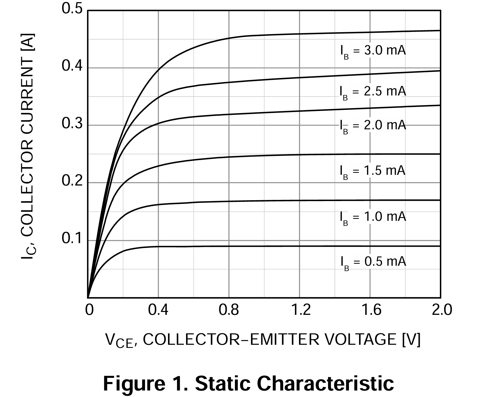
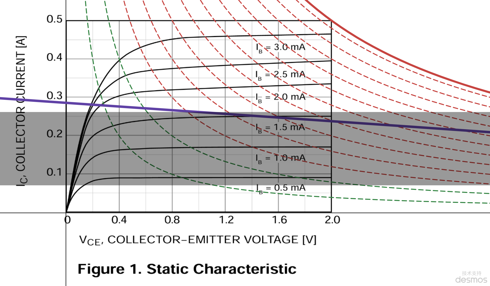

# Lab 4：电路基础实验 — 从数据自动化到音乐合成

> 北京大学 整合科学班 综合实验  
> 实验人：马健文 | 2026年5月

---

## 令人头疼的 LabVIEW

原本实验大纲要求使用 LabVIEW 配合 NI DAQ 完成数据采集任务。但理想很丰满，现实很骨感——最新的 LabVIEW 2026Q1 版本对 DAQmx 不支持，而卸载重新安装极其缓慢，几乎无法正常工作。

于是我走了另一条路：**Python + NI DAQmx**。用代码而不是图形化编程来完成所有采集、控制和数据分析任务。事实证明，这条路不仅走通了，还走得相当远——从 RC 滤波器的频率响应，一路做到了用电磁铁当架子鼓来演奏 *We Will Rock You*。

> **实验核心问题：** 如何用 DAQ 自动化替代传统手动测量？如何驱动真实世界的负载（电磁铁）而非只是看波形？如何把传感器信号变成有物理意义的温度数据？

---

## 实验一：RC 滤波器 — 手动测量 vs 自动化采集

### 传统手工法

用信号发生器 + 示波器 + 万用表，一个频率一个频率地调、读数、记录。

很经典，也很慢。40 个频率点下来，眼睛都看累了，而且读数精度受限于肉眼判读示波器网格。

### DAQ 自动化扫频

用 NI DAQ 卡的 AI/AO 通道完成自动化测量：

1. 信号发生器手动设定频率（硬件条件限制，未能实现 DAQ 直接控制信号源，之后可以尝试自动化闭环）
2. DAQ 同步采集输入和输出通道的波形
3. **FFT 自动识别主频**，再用正弦曲线拟合精确提取幅值和相位
4. 计算复数传递函数：$H(\omega) = \frac{A_{\text{out}}}{A_{\text{in}}} e^{j\Delta\phi}$

一个核心细节是，为什么不用简单的"读最大值"来算增益？因为噪声和直流偏置会严重干扰。用 FFT 做频域筛选 + 时域正弦拟合，才能从被噪声污染的波形中稳定提取参数。

>> 从数据中看到了什么？幅频曲线随频率升高趋近于 1（高通滤波器的本色），相频从接近 90° 逐渐回落。这就是一阶 RC 高通网络的特征。

### 参数反推

采集到的离散频率点还可以做一件有意思的事：用物理模型去**拟合**电路参数。

$$|H(\omega)| = K \frac{\omega RC}{\sqrt{1+(\omega RC)^2}}$$

从拟合结果可以反推出电路的时间常数，进而用已知的电阻反推电容（或反之）。这是"测量 → 建模 → 参数提取"的经典实验物理路径。

---

## 实验二：三极管 + 电磁铁 — 从信号世界到功率世界

前面的 RC 电路是无源的，信号在毫瓦级别。现在来做点真的——用三极管驱动一个 12V 的电磁铁。

### 三极管的三个世界：截止 · 放大 · 饱和

把一个 NPN 三极管接成共射组态（common-emitter），它就变成了一个"电流控制电流源"——基极电流 $I_B$ 的小变化，能引起集电极电流 $I_C$ 的大变化。但同一个器件，工作在不同的偏置条件下，会表现出截然不同的行为：

| 工作区 | $I_B$ 条件 | $V_{CE}$ 特征 | 用途 |
|--------|-----------|--------------|------|
| **截止区** | $I_B = 0$ | $V_{CE} \approx V_{CC}$ | 开关断开 |
| **放大区** | $0 < I_B < I_{B(\text{sat})}$ | $V_{CE}$ 随 $I_B$ 线性变化 | 信号放大 |
| **饱和区** | $I_B \geq I_{B(\text{sat})}$ | $V_{CE} \approx V_{CE(\text{sat})}$ (很小) | 开关闭合 |

SS8050 我们当成开关用，那就是让它**在截止区和饱和区之间来回跳跃**，不在放大区停留。这个直觉上很简单的要求，在工程实现时却需要仔细计算。

### 基极电流该给多少？从数据手册获取

设计开关的第一步是弄清楚电磁铁需要多大电流。实测电磁铁线圈内阻 $R = 42\ \Omega$，电源 $12\ \text{V}$，所以吸合时集电极电流为：

$$I_C \approx \frac{12\ \text{V}}{42\ \Omega} \approx 0.28\ \text{A}$$

现在问题来了：**需要多大 $I_B$ 才能让三极管进入饱和？**

这就涉及 $h_{FE}$（也叫 $\beta$，直流电流放大系数）。这是一颗三极管最核心的参数，但同时也是最容易被"一个数字"误导的参数。

> **来这里，查查这颗 SS8050 的 data sheet：https://www.onsemi.com/pdf/datasheet/ss8050-d.pdf**  
> 找找看它的 $h_{FE}$ 是多少。  
> 你会发现它不是一个固定值——它随 $I_C$ 变化，随温度变化，而且 datasheet 上通常给的是一个**范围**（比如"200~350"）而不是一个确定数。可以拿它来做一个估算。实际上数据手册上还直接给出了静态 $I_C$ 关于 $U_{CE}$ 变化的曲线，可以直接进行作图计算输入电流。例如：


查到 $h_{FE}$ 之后，计算"理论上需要多少基极电流才能支持 0.28 A 的集电极电流"：

$$I_{B(\text{min})} = \frac{I_C}{h_{FE}} \approx \frac{0.28}{200} \approx 1.4\ \text{mA}$$

但这里埋着一个陷阱。

### 深饱和：为什么"够用"是不够的

如果只给 1.4 mA 的基极电流，三极管会停在**放大区的边缘**——它确实能提供 0.28 A 的 $I_C$，但 $V_{CE}$ 还比较大，可能有 1-2 V。这时三极管上的功耗：

$$P = V_{CE} \times I_C \approx 1.5\ \text{V} \times 0.28\ \text{A} \approx 0.42\ \text{W}$$

对于 TO-92 封装来说，长时间 0.4 W 以上会明显发热，甚至可能烧毁。

工程上常用的解决方法是**过驱动**——让 $I_B$ 远超理论最小值，强行把器件**深推入饱和区**。饱和的标志是 $V_{CE}$ 降到极小值（SS8050 的 $V_{CE(\text{sat})}$ 一般在 0.3-0.5 V），此时：

$$P = V_{CE(\text{sat})} \times I_C \approx 0.5\ \text{V} \times 0.28\ \text{A} \approx 0.14\ \text{W}$$

热量降为原来的三分之一。实际电路中基极电流设到了 5 mA——大约是理论值的 3.5 倍。

### 基极电阻的计算

有了 $I_B = 5\ \text{mA}$ 这个目标值，就可以反过来算 DAQ 输出端需要串多大的基极电阻：

$$R_B = \frac{V_{\text{AO}} - V_{BE}}{I_B}$$

$V_{BE}$ 在饱和时大约 0.7-0.8 V（查 datasheet 确认这个值）。那么 DAQ 输出 $1\ \text{V}$ 时：

$$R_B = \frac{1.0 - 0.7}{5\ \text{mA}} = 60\ \Omega$$

实际选用了 $47\ \Omega$（电阻没有 60 Ω 的标准值，取邻近标称值偏小一侧以确保有足够基极电流）。

> ✅ 查阅 datasheet 时的核对清单：
> - $h_{FE}$ 在你需要的 $I_C$ 条件下是多少？datasheet 上通常会给出不同 $I_C$ 下的典型值
> - $V_{CE(\text{sat})}$ 是多少？这决定了饱和时的功耗
> - 最大集电极电流 $I_{C(\max)}$ 是多少？0.28 A 是否安全？
> - 最大功耗 $P_{tot}$ 是多少？当前工况是否需要加散热？

这三个步骤——计算负载电流 → 确定饱和基极电流 → 算出基极电阻——构成了三极管开关设计的完整链路。每个环节都需要你亲手翻阅 datasheet 获取参数，而不是仅凭一个"$h_{FE}=200$"的印象就下结论。

也可以使用给出的性能曲线作图分析（供电电压取12V）：

这幅图里面的绿线和红线代表功率和温度。每条线温度比上一条线高10℃。因此红色的线表示的区域温度已经达到了55℃以上，已经是不安全的范围了。最上面的粗红线为器件的功率上限1W，此时温度比环境温度高125℃，处在烧坏的边缘。黑色区域以上的部分表示电流能使电磁铁可靠吸合，以下的部分表示电流能使电磁铁可靠释放。紫色的线为根据电磁铁计算得出的三极管分压曲线。三极管真实分到的电压可以如下读出：先计算此时的基极电流 $I_B$, 随后读出对应电流的曲线和紫色线的交点。可以发现这一设定下，取 $I_B > 1.6 \mathrm{mA}$ 可以确保可靠吸合且发热可控。

### 电磁铁的"双稳态"现象

电磁铁的吸合和释放不在同一个电压点——吸合需要 ~11V，而释放要到 ~3V 才发生。这不是铁芯的磁滞（剩磁），而是一个力学双稳态：弹力和磁力在中间电压区域可以同时支撑"闭合"和"断开"两种平衡状态。

这个现象的直观启示是：**机械负载的"控制"远比纯电学负载复杂**——软件里写一个 if-else 是瞬间翻转的，现实世界有迟滞、有惯性、有非线性。

### 用门锁奏乐

用 Python 控制 DAQ 输出高低电平，让电磁铁以特定节奏吸合/释放。一开始是 1 秒等间隔，然后编写了频率逐渐加快的版本（从 1 秒到 0.05 秒步进递减）。当你听到电磁铁从 "嗒...嗒...嗒..." 加速到 "嗒嗒嗒嗒嗒" 的时候，能直观感受到物理系统的响应极限——间隔太短时，电磁铁还没来得及完全释放就被再次触发，机械响应开始失真。其实 DAQ 的数字输出更适合来驱动电磁铁，它们的响应更快。

---

## 实验三：NTC 热敏电阻 — 做一个实时温度计

### 电路设计：比例测量法

用一个固定精密电阻（75.3 kΩ）和 NTC 热敏电阻串联分压。关键的设计智慧是：**引入一路独立的参考电压测量**。

$$
R_t = R_{\text{ref}} \times \frac{V_{\text{ntc}}}{V_{\text{source}} - V_{\text{ntc}}}
$$

这不是简单的分压公式——它实时监测源电压 $V_{\text{source}}$ 的变化，消除了供电波动带来的比例误差。DAQ 同时采集两路 AI，在数字域做除法，相当于设计了一个自动校准的比率计。

### 校准：冰水浴 + 室温

NTC 的阻值-温度关系遵循指数模型：

$$R_t = R_0 \cdot e^{B(1/T - 1/T_0)}$$

只用两个已知温度点（冰水浴 0°C 和一个室温值）就能标定出 B 常数和 $R_0$，建立起完整的测温公式。

### 接触不良的"幽灵尖峰"

长时间监测中观察到温度曲线上偶发出现向下的异常尖峰——温度"骤降"到负值。

这不是真的降温。NTC 是负温度系数，温度下降对应阻值增大。尖峰意味着热敏电阻支路在一瞬间开路，阻值剧增，被系统误判为超低温。**真正的原因是：面包板上的接触点松动。**

这很明显是硬件的锅。解决方案可以是焊接（去掉面包板）或者往面包板的插孔中再插入一个杜邦线公头，以增大接触压强。

---

## 实验四：用 DAQ 做音乐合成

整活环节qwq

### 正弦波演奏

最简单的思路：每个音符对应一个频率的正弦波，通过 DAQ 的 AO 通道输出到压电蜂鸣器。*小星星* 的旋律就出来了。听起来音色比较单调。

### Karplus-Strong 算法：一根"数字琴弦"

正弦波太干净了，不像真实的乐器。Karplus-Strong 算法是一种经典的物理建模合成方法：

1. 用一个短噪声脉冲激励一个循环缓冲区
2. 每周期做一次相邻点平均（模拟波在琴弦上的传播损耗）
3. 每周期乘以一个略小于 1 的衰减因子

最终得到类似**拨弦**的音色——谐波丰富，有一定的"琴弦感"。但是我发现它演奏的小星星严重跑调，很多音准都飘到隔壁音去了。音准偏差的根源是什么？我觉得在这里主要是周期长度的问题。当 `sample_rate / freq` 不是整数时，截断误差会累积，导致实际音高偏离理论值。

### 加法合成 + 钢琴包络

更进一步，用加法合成（基波 + 若干谐波叠加）配合 ADSR 包络（Attack-Decay-Sustain-Release），模拟钢琴音色。这时听起来音准就更好了。

最后蜂鸣器发出的声音，高频成分非常大，听起来尖锐刺耳。这个一方面是受到 DAQmx 输出采样率和量化精度限制，另一方面压电蜂鸣器的谐振区间也在 1kHz 以上的较高频段。使用RC滤波效果较差，并且还会使蜂鸣器音量降低。既然硬件限制无法解决，那我就直接使用物理方法进行滤波：在蜂鸣器上面盖一层软垫子（鼠标垫）。高频声波的衰减大于低频，成功实现了还不错的效果。


### We Will Rock You：一台电磁铁架子鼓

整活：**用电磁铁的撞击声当鼓点，蜂鸣器演奏旋律。**

DO 数字输出控制电磁铁（底鼓/军鼓节奏），AO 模拟输出控制蜂鸣器（旋律），两个线程并行运行，靠共同的起始时间戳同步。

我后面尝试了一下，效果比较一般，可能是我时间上没有完全处理好。DAQ 同时控制模拟和数字输出似乎比较困难。不过确实挺好玩的www

---

## 番外篇：量化噪声与 ADC 的隐藏世界

为了搞清楚如何提高蜂鸣器的音准，我对量化噪声进行了一些初步学习。ADC 把连续信号变成离散数字时会产生量化误差，这个误差的频谱并不是白噪声，而是有结构的。

- 8-bit 量化：误差大，频谱上能看到明显的谐波梳状结构
- 16-bit 量化：误差小，但仍存在周期性结构
- **加窗与否**对频谱分析影响显著，汉宁窗抑制了频谱泄漏，但也抹掉了一些细节
- 零阶保持（ZOH）导致了 $\text{sinc}$ 包络调制——这是所有 DAC 输出的固有特性

2D 频谱图尤其迷人：以输入频率为 Y 轴、输出频率为 X 轴，展示量化噪声在频域的完整映射。你可以清晰地看到基波对角线、镜像混叠线和量化噪声的分布模式。

---

## 实验架构总览

```
Lab4/
├── RC 滤波器
│   ├── oscilloscope.py         # DAQ自动化采集 (FFT + 正弦拟合)
│   ├── RC_circuit_fit.py       # 物理参数拟合 (时间常数提取)
│   └── rc_circuit_results.csv  # 测量数据
│
├── 电磁铁驱动
│   ├── electromagnet_control.py      # 周期性开关控制
│   ├── electromagnet_control_new.py  # 频率渐增版
│   └── sinusoidal_output.py          # AO正弦波输出
│
├── NTC 热敏电阻测温
│   ├── temperature_calibration.py          # 两点校准 (B常数 + R₀)
│   ├── temperature_measure.py              # 实时监测与记录
│   └── temperature_measure_and_electromagnet_control.py  # 温度+电磁铁组合
│
├── 音乐合成
│   ├── music/          # 继电器流水脉冲 (门锁控制)
│   ├── music/little_star.py          # 正弦波演奏小星星
│   ├── music/little_star_piano.py    # Karplus-Strong 弦乐版
│   ├── music/little_star_piano_additive.py  # 加法合成 + 钢琴包络
│   └── music/Rock_you.py             # 电磁铁架子鼓 + 蜂鸣器旋律
│
├── 量化噪声研究
│   ├── quantification_noise/simulator.py          # 量化噪声 FFT 分析
│   ├── quantification_noise/simulator_without_hanning.py  # 无窗版 (ZOH 阶梯波)
│   └── quantification_noise/2D power spectrum.py  # 2D 量化噪声频谱图
│
├── 工具脚本
│   ├── device_enquire.py     # 检测 NI DAQ 设备
├── generate_plots.py         # 实验数据可视化
└── report.tex                # LaTeX 实验报告
```

---

## 几点感悟

1. **自动化大大提升效率** 手动测 40 个频率点需要半小时还全是读数误差，DAQ 自动扫频只需几分钟——而且每次测量都是多次采样平均，精度远超肉眼。

2. **纯软件思维在硬件世界不够用** 三极管的深饱和设计、接触电阻的尖峰诊断、电磁铁的响应延迟——这些问题没法靠写更优雅的代码解决，必须理解物理器件的实际行为。

3. **Python + DAQ 是替代 LabVIEW 的可行路径。** 当闭源的商业软件掉链子时，NI DAQmx 的 Python API (nidaqmx) 提供了完整的底层控制能力——代价是你要自己处理采样时钟配置、缓冲区管理、线程同步这些 LabVIEW 帮你封装好的细节。

4. **动手做音乐是对实验最好的检验。** 要演奏一段旋律，频率必须精确，时序必须准确，输出必须稳定——它在无意中变成了整个采集链路的端到端功能测试。

---

## 参考资料

- NI-DAQmx Python documentation: `nidaqmx` package
- Karplus-Strong algorithm: "Digital Synthesis of Plucked-String and Drum Timbres" (1983)
- NTC Thermistor B-parameter equation: Steinhart-Hart 方程的简化形式
- 元器件：Grallen ATF20B 信号发生器 / Tektronix TBS 1102B-EDU 示波器 / Fluke 15B+ 万用表 / NI DAQ 采集卡 / SS8050 NPN 三极管
